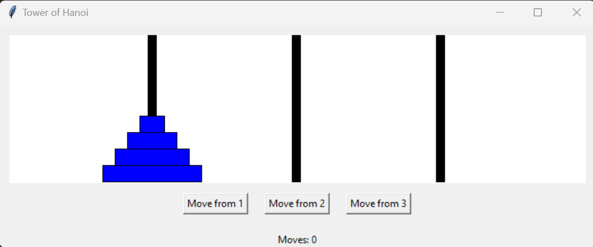

# TowerOfHanoi-Tkinter

## Overview
**TowerOfHanoi-Tkinter** is a Python implementation of the classic Tower of Hanoi puzzle using the Tkinter library for a graphical user interface (GUI). The game allows users to choose the number of disks and pegs, and visually solve the puzzle by moving disks from one peg to another.

The project is designed to make learning and solving the Tower of Hanoi more interactive and engaging, with real-time feedback and a simple, user-friendly interface.

## Features
- Dynamic selection of the number of disks (1 to 10).
- Ability to choose between 3 to 5 pegs.
- Visual display of peg and disk movement.
- Move counter to track your progress.
- Winning condition check with a congratulatory message.
- Option to restart the game after winning.

## Game Rules
The Tower of Hanoi is a mathematical puzzle where:
1. You have `N` disks of different sizes stacked in decreasing order on one of the pegs.
2. The goal is to move all the disks to another peg, obeying the following rules:
   - Only one disk can be moved at a time.
   - You can only move the top disk from any peg.
   - A disk can only be placed on top of a larger disk or on an empty peg.
   
The minimum number of moves required to solve the puzzle is `(2^N - 1)` where `N` is the number of disks.

## Screenshots

## Installation and Setup

### Prerequisites
- Python 3.x
- Tkinter (Usually comes pre-installed with Python)

### Game Controls
- **Select Pegs**: Use the buttons labeled "Move from X" (where X is the peg number) to select the source peg and move a disk to the target peg.
- **Move Tracking**: The move counter displayed at the bottom of the screen will update after each successful disk move.
- **Winning the Game**: Once all the disks are successfully moved to the last peg, a pop-up message will appear congratulating you and displaying the total number of moves.

### How to Play
1. When you start the game, you'll be prompted to enter the number of disks (between 1 and 10) and the number of pegs (between 3 and 5).
2. The game will display pegs and disks based on your input.
3. To move a disk:
   - Select the peg from which you want to move the top disk.
   - Then, select the peg where you want to place the disk. You can only place a disk on top of a larger disk or an empty peg.
4. Continue moving disks according to the game rules until all disks are moved to the last peg in decreasing size order.
5. The game tracks your moves, and the goal is to solve the puzzle in the minimum number of moves possible.

Good luck and enjoy the puzzle!

### Future Enhancements
Here are some potential future improvements for the project:
- **Color Schemes**: Add different color themes for the disks and pegs to make the game more visually appealing.
- **Sound Effects**: Implement sound effects for moves and victory to enhance user engagement.
- **Auto-Solver**: Provide an option for the player to see the solution using the minimum number of moves (2^N - 1 moves).
- **Timer**: Add a timer to track how long it takes for a player to solve the puzzle.
- **Difficulty Levels**: Include predefined difficulty levels (easy, medium, hard) that determine the number of disks.
- **Game History**: Track and display a player's game history with moves and time taken for each game.

### Contributing
Contributions to this project are highly encouraged!
